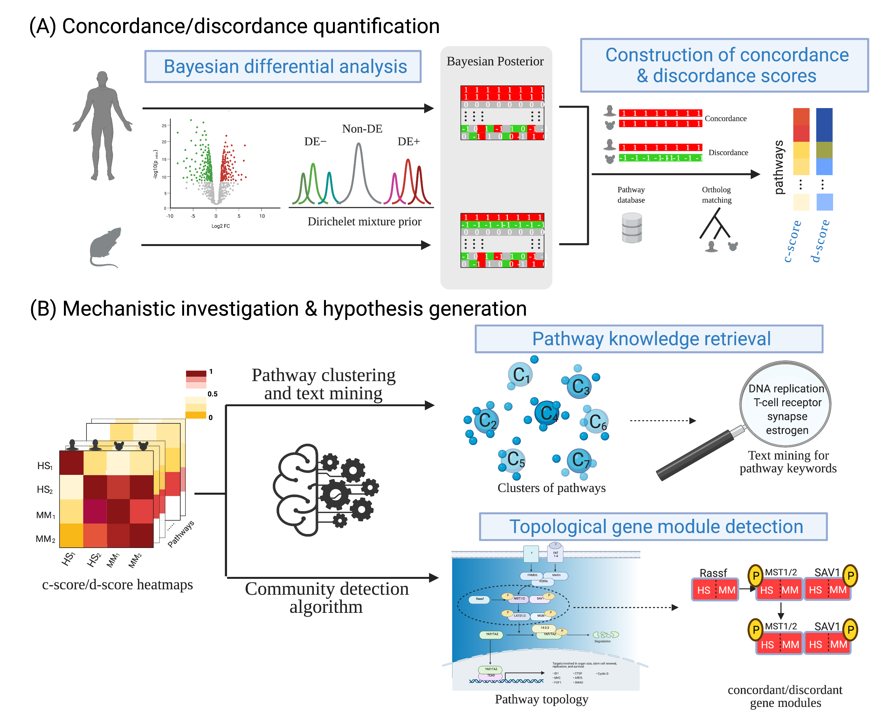

```{r, include = FALSE}
knitr::opts_chunk$set(
  collapse = TRUE,
  comment = "#>"
)
```

```{r setup, eval=FALSE}
```

#Introduction

##Background

As human studies often encounter numerous constraints, including larger biological heterogeneity, hidden confounding factors, greater cost and time, and potential ethical concerns, model organisms have played an indispensable role in pre-clinical research to understand pathogenesis of human diseases at the behavioral, cellular and molecular level. Despite their indispensable role in mechanistic investigation and drug development, molecular congruence of animal models to human has long been questioned and debated. We hereby introduce a comprehensive and quantitative framework, namely Congruence Analysis of Model Organisms (CAMO), for congruence and translational evaluation of animal models in their molecular responses in omics data. CAMO is served as an objective and quantitative approach to identify biomarkers, pathways and topological gene modules that are best or least mimicked by the model organism. 

##Workflow

```{r,echo = FALSE,out.width='90%',fig.align="center",fig.cap="Figure 1: Workflow of the CAMO framework."}

```

Figure 1 presents an overview of the CAMO pipeline, consisting of state-of-the-art methods and novel approaches for a thorough congruence evaluation. 

(A). The steps to calculate genome wide and pathway level c-scores and d-scores for a pair of human study (HS) and mouse study (MS), which consists of 

*  Differential analyses contrasting cases and controls groups in inividual cohorts separately. 
*  Threshold-free Bayesian differential analysis to transform frequentist p-values to differential posterior probabilities. 
*  Construction of cross-species (or cross-cohort in the same species) concordance/discordance scores (c-scores/d-scores) using a stochastic version of confusion matrix and F-measure. 
*  Permutation test to derive p-values of c-scores and d-scores.

When multiple cohorts are jointly analyzed, c-scores and d-scores are calculated for all pair-wise studies in each individual pathway.


(B). Downstream machine learning and bioinformatics tools for comparative analysis and knowledge discovery using pairwise scores and their p-values of multiple studies, which includes

* Unsupervised pathway clustering method to cluster pathways with similar concordance/discordance patterns across studies.
* Automated text mining algorithm to retrieve representative keywords in each pathway cluster. 
* Community detection algorithm to identify concordant or discordant subnetworks for a pair of models based on the topological regulatory information for KEGG pathways. 


#Example: human and mouse inflammatory diseases comparison
To demonstrate how to perform congruence analysis of multiple studies using CAMO package, we utilize two human and two mouse inflammatory diseases (Burn and Sepsis), which are part of the data used in case study 1 in the CAMO paper. 

##1. Construct genome-wide and pathway level c-scores and d-scores
We first run differential anlysis (LIMMA for microarray data) followed by the Bayesian differential analysis to transform frequentist p-values to differential posterior probabilities for each study to derive the empirical distribution of DE indicators for each gene. The MCMC step in Bayesian analysis may take a while.

```{r, eval=FALSE}
library(CAMO)

data(hb)#load human burn data
summaryDE = indDE(data=data,group=as.factor(group),data.type="microarray",
                   case.label="2", ctrl.label="1")#differential anlysis
hb_pData = summaryDE[,c(3,1)]
hb_MCMCout = bayes(hb_pData, seed=12345)#Bayesian differential analysis

data(hs)#load human sepsis data
summaryDE = indDE(data=data,group=as.factor(group),data.type="microarray",
                   case.label="2", ctrl.label="1")#differential anlysis
hs_pData = summaryDE[,c(3,1)]
hs_MCMCout = bayes(hs_pData, seed=12345)#Bayesian differential analysis

data(mb)#load mouse burn data
summaryDE = indDE(data=data,group=as.factor(group),data.type="microarray",
                   case.label="2", ctrl.label="1")#differential anlysis
mb_pData = summaryDE[,c(3,1)]
mb_MCMCout = bayes(mb_pData, seed=12345)#Bayesian differential analysis

data(ms)#load mouse sepsis data
summaryDE = indDE(data=data,group=as.factor(group),data.type="microarray",
                   case.label="2", ctrl.label="1")#differential anlysis
ms_pData = summaryDE[,c(3,1)]
ms_MCMCout = bayes(ms_pData, seed=12345)#Bayesian differential analysis

```

We merge the MCMC matrices by orthologs mapping between human and mouse genes.

```{r, eval=FALSE}
mcmc.list = list(hb_MCMCout,hs_MCMCout,
                  mb_MCMCout,ms_MCMCout)
species = c(rep("human",2), rep("mouse",2))#specify species for each MCMC matrix
data(hm_orth)##load orthologs file, retrieved from:https://fgr.hms.harvard.edu/diopt
mcmc.merge.list <- merge(mcmc.list,species = species,
                         ortholog.db = hm_orth, reference=1)
save(mcmc.merge.list, file = "mcmc.merge.list.RData")
```

Then, we construct genome-wide c-scores and d-scores with permutation test to derive p-values.
```{r,eval=FALSE}
dataset.names = c("hb","hs","mb","ms")#specify study names for each merged MCMC matrix
set.seed(12345)
ACS_ADS_global = multi_ACS_ADS_global(mcmc.merge.list,dataset.names,
                                      measure="Fmeasure",B=1000)
save(ACS_ADS_global,file="ACS_ADS_global.RData")

```

For pathway level c-scores and d-scores, we first select pathways of interest by meta-enrichment-analysis and then c-scores and d-scores with permuted p-values can be calculated similarly.
```{r,eval=FALSE}
#Select pathways by meta-enrichement-analysis 
data(human.pathway.list) #load pathway database, this includes KEGG and Reactome database
select.pathway = pathSelect(mcmc.merge.list,pathway.list,
                             pathwaysize.lower.cut = 5,
                             pathwaysize.upper.cut=200,
                             overlapsize.cut = 5, med.de.cut =3,
                             qfisher.cut = 0.05)
(K = length(select.pathway))
select.pathway.list = pathway.list[select.pathway]
save(select.pathway.list,file=paste(WD,"/select_",K,"_pathways.RData",sep=""))

set.seed(12345)
ACS_ADS_pathway = multi_ACS_ADS_pathway(mcmc.merge.list,dataset.names,
                                        select.pathway.list,
                                        measure="Fmeasure",
                                        B=1000,parallel=F)
save(ACS_ADS_pathway,file="ACS_ADS_pathway.RData")

```

##2. Downstream visualizations

### (i) Genome-wide MDS plot of c-scores 
We apply the multi-dimensional scaling (MDS) plot using transformation of the genome-wide c-scores as dissimilarity measure provides congruence visualization.The plot will be automatically saved to the current directory.
```{r,eval=FALSE}
acs.value = c(ACS_ADS_global$ACS)
names(acs.value) = c(sapply(rownames(ACS_ADS_global$ACS),function(x) paste(x,rownames(ACS_ADS_global$ACS),sep="_")))
mdsGlobal(acs.value,dataset.names,sep="_",file="globalMDS_cscores.pdf")
```


### (ii) Consensus tight clustering and text mining
We first select the optimal number of clusters by consensus clustering. The consensus CDF and delta area plot will be automatically saved to the current directory to determing the number of pathway clusters.

```{r,eval=FALSE}
ACSpvalue.mat = ACS_ADS_pathway$ACSpvalue.mat
results = ConsensusClusterPlus(d=t(-log10(ACSpvalue.mat)),maxK=10,reps=50,pItem=0.8,pFeature=1,title="seed 12345",clusterAlg="hc",innerLinkage="ward.D2",finalLinkage="ward.D2",seed=12345,plot="png")

```

Then, we apply the consensus clustering with specified K and allow pathways with small silhouette index to be removed from the current clusters repeatedly until every pathway has a silhouette index above the selected cutoff (0.1). Text mining will then be applied to each tight cluster. Heatmap and MDS of the minus-log-transformed p-values of pathway level c-scores in pair-wise studies will be saved as pdf files. Text minining results will be saved as a spreadsheet. In addition, the co-membership heatmaps summarizing the proportion of significantly concordant pathways within each pathway cluster between each pair of studies will also be saved.   

```{r,eval=FALSE}
data(hashtb_human) #load the phathway-phrase matrix for text mining
set.seed(12345)
multiOutput(mcmc.merge.list,dataset.names,select.pathway.list,
            ACS_ADS_pathway, output=c("clustPathway"),
            hashtb=hashtb,pathways=pathways,optK = 4,keywords_cut=0.2,comemberProb_cut=0.75)

```

### (iii) Individual pathway visualizations
CAMO package provides within pathway visualization tools to visualize the pairwise c-scores/d-scores for individual pathways of interests. For each pathway, "mdsModel" and "clustModel" provide MDS and clustering heatmap for study clusteres, "genePM" provides a gene-wise heatmap of posterior mean of DE evidence for all studies, "keggView" and "reactomeView" generate the topology graph where gene nodes are colored by its concordance/discordance information in a study pair.

```{r,eval=FALSE}
##mdsModel, clustModel, genePM
sub_select.pathway.list = select.pathway.list[c("KEGG B cell receptor signaling pathway",
                                                "KEGG Leukocyte transendothelial migration",
                                                "Reactome TCR signaling")]#select pathway of interests
multiOutput(mcmc.merge.list,dataset.names,select.pathway.list=sub_select.pathway.list,
            ACS_ADS_pathway, output=c("mdsModel","clustModel","genePM"))

##keggView
multiOutput(mcmc.merge.list,dataset.names,select.pathway.list=sub_select.pathway.list,
            ACS_ADS_pathway, output=c("keggView"),
            ViewPairSelect = NULL, # will generate for all study pairs automatically
            kegg.species="hsa",
            KEGG.dataGisEntrezID=FALSE, # data genes are symbols, not entrezID
            KEGG.dataG2EntrezID=NULL, # when not provided, org.Hs.eg.db is used to map gene names
            KEGG.pathID2name=NULL) #when not provided, KEGGREST is used to retrieve pathway ID

##reactomeView
multiOutput(mcmc.merge.list,dataset.names,select.pathway.list=sub_select.pathway.list,
            ACS_ADS_pathway, output=c("reactomeView"),
            ViewPairSelect = NULL,# will generate for all study pairs automatically
            reactome.species="HSA",
            Reactome.dataG2TopologyGtype=NULL, # when not provided, search for data gene names on Reactome topology directly
            Reactome.pathID2name=NULL) #when not provided, reactome.db is used to retrieve pathway ID

```
